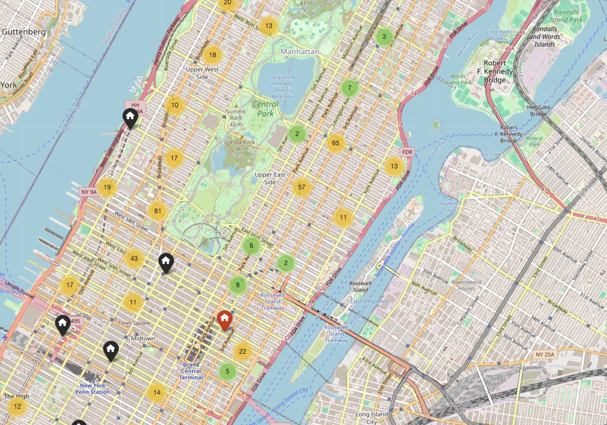
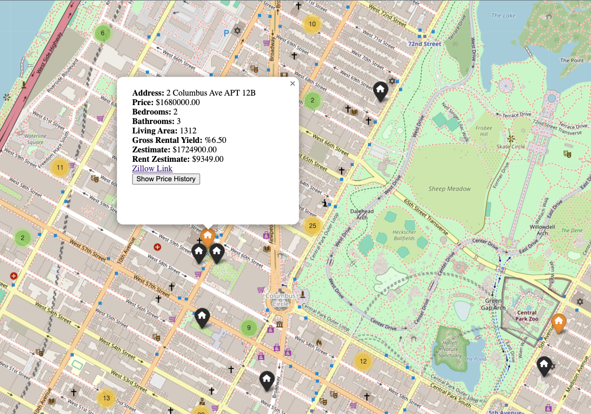

# Real-Estate-Scouting

This project is a Flask-based web application that visualizes Zillow rental property data on an interactive map using Folium. The dashboard allows users to explore property details, assess rental yields, and access links for properties directly from the map interface.



## Features

- Interactive Map: Visualize properties on a map with color-coded markers based on gross rental yield.
- Rental Property Insights:
- Price
- Zestimate and Rent Zestimate
- Number of Bedrooms and Bathrooms
- Gross Rental Yield
- Living Area
-Street Address
**Dynamic Markers:** Different marker colors based on the gross rental yield:
    * **Green:** High yield (> 8%)
    * **Orange:** Moderate yield (5%-8%)
    * **Red:** Low yield (< 5%)
    * **Gray:** Missing yield
    * **Black:** Off-market properties





## Usage
**Initial Setup:** Upon the first run, the app generates the interactive map (property_map.html) if it doesn't already exist.

**Map Interaction:**
Explore properties by clicking on map markers.
View detailed property information in the popup.
Use the "Show Price History" button to navigate to the property's Zillow page.

## Requirements

Requirements:

```Bash
pyenv local 3.11.3
python -m venv rescouting
source rescouting/bin/activate
pip install --upgrade pip
```
